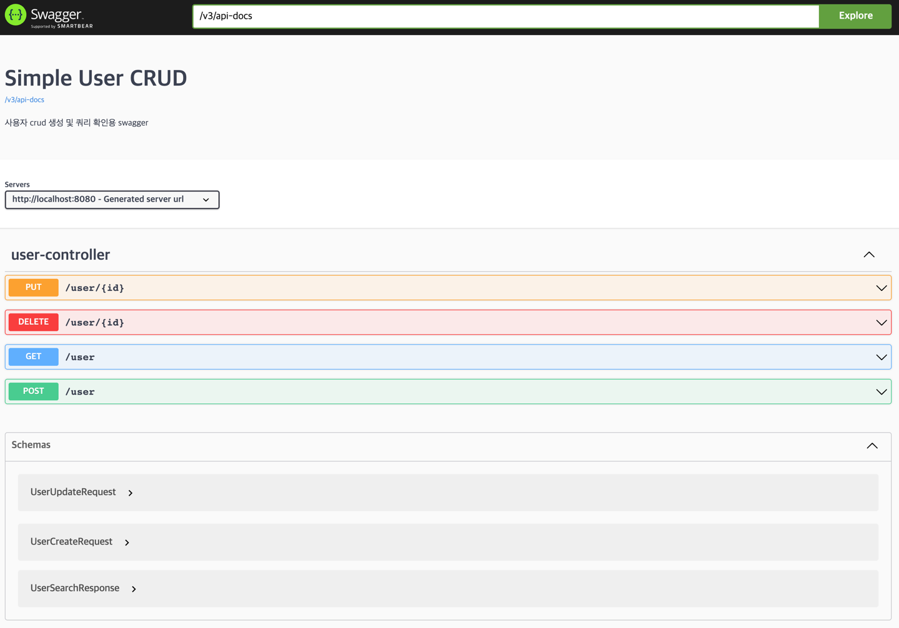

# Spring p6spy Query Log

p6spy 라이브러리를 이용하여 아래와 같이 쿼리의 속도 및 실행한 쿼리를 확인할 수 있습니다.



코드 실행 후 h2 및 swagger 설정으로 확인할 수 있습니다.

``` bash
http://localhost:8080/h2-console
```

``` bash
http://localhost:8080/swagger-ui/index.html
```

쿼리와 관련된 코드는 아래와 같이 3개의 파일이 관련이 있습니다.

`confing/P6SpySqlFormatterConfig`, `resources/spy.properties`, `resources/application.yml`